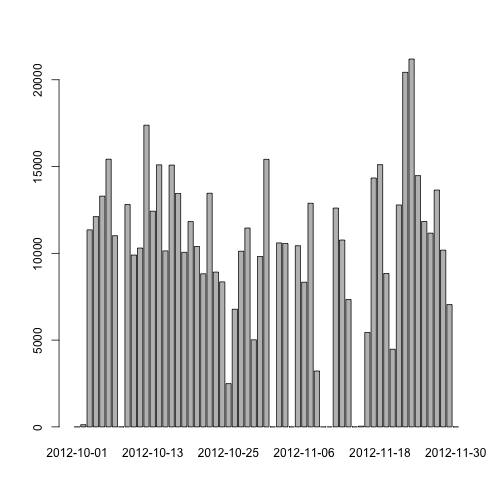
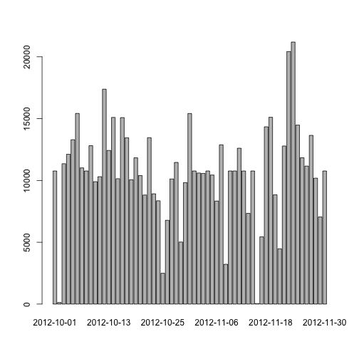
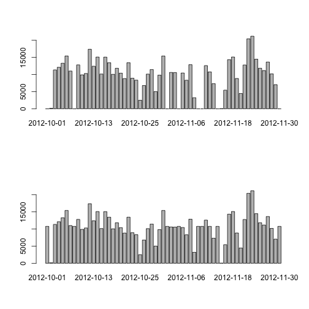
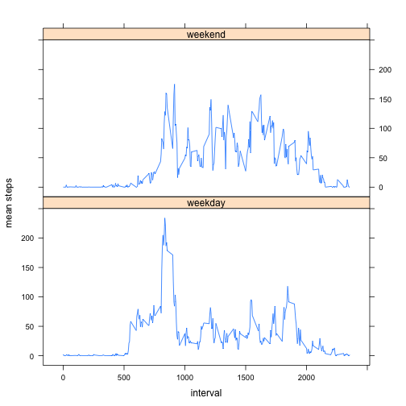

## Loading and preprocessing the data

```r
dt.activity <- read.csv(unz("activity.zip","activity.csv"))
dt.activity$date <- as.Date(dt.activity$date, format="%Y-%m-%d")
head(dt.activity)
```

```
##   steps       date interval
## 1    NA 2012-10-01        0
## 2    NA 2012-10-01        5
## 3    NA 2012-10-01       10
## 4    NA 2012-10-01       15
## 5    NA 2012-10-01       20
## 6    NA 2012-10-01       25
```
## What is mean total number of steps taken per day?

Summing steps for each day :


```r
library(plyr)
dt.steps_by_day <- ddply(.data = dt.activity, .variables = c("date"), sum=sum(steps,na.rm=1),summarize)
```

Making a histogram of steps taken each day :

```r
barplot(dt.steps_by_day$sum,names.arg = dt.steps_by_day$date)
```

 

Calculating mean steps per day:


```r
mean(dt.steps_by_day$sum,na.rm=1)
```

```
## [1] 9354.23
```


Calculating median steps per day:


```r
median(dt.steps_by_day$sum,na.rm=1)
```

```
## [1] 10395
```

## What is the average daily activity pattern?

Calculating summary table for intervals :


```r
dt.steps_by_interval <- ddply(.data = dt.activity, .variables = c("interval"), sum=sum(steps,na.rm=1),mean=mean(steps,na.rm=1),summarize)
```

Mean steps for each interval time series plot:


```r
plot(dt.steps_by_interval$mean ~ dt.steps_by_interval$interval, type="l", xlab="5-min Interval number", ylab="Mean number of steps")
```

 

What interval has maximum average number of steps across all days?

```r
with (dt.steps_by_interval,interval[mean == max(mean)])
```

```
## [1] 835
```

## Imputing missing values

Number of missing values:


```r
colSums(is.na(dt.activity))
```

```
##    steps     date interval 
##     2304        0        0
```

Now we are going to replace missing values with the average steps value for the same interval across all days


```r
dt.activity_imputed <- ddply(.data=dt.activity,.variables = .(interval),  steps = ifelse(is.na(steps),mean(steps,na.rm=1),steps), transform)

colSums(is.na(dt.activity_imputed))
```

```
##    steps     date interval 
##        0        0        0
```

Now we repeat histogram, mean and median calculations for the imputed data:


```r
dt.steps_by_day_imputed <- ddply(.data = dt.activity_imputed, .variables = c("date"), sum=sum(steps),summarize)
```


Making a histogram of steps taken each day for imputed data:

```r
barplot(dt.steps_by_day_imputed$sum,names.arg = dt.steps_by_day_imputed$date)
```

 

Putting two plots under each other so it is easier to compare

```r
par(mfrow=c(2,1))
barplot(dt.steps_by_day$sum,names.arg = dt.steps_by_day$date)
barplot(dt.steps_by_day_imputed$sum,names.arg = dt.steps_by_day_imputed$date)
```

 

Calculating mean steps per day:


```r
mean(dt.steps_by_day_imputed$sum)
```

```
## [1] 10766.19
```


Calculating median steps per day:


```r
median(dt.steps_by_day_imputed$sum)
```

```
## [1] 10766.19
```


## Are there differences in activity patterns between weekdays and weekends?

Creating categorical variable:


```r
dt.activity$is.weekday <- as.factor(ifelse(weekdays(dt.activity$date) %in% c("Sunday","Saturday"),"weekend","weekday"))

table(dt.activity$is.weekday)
```

```
## 
## weekday weekend 
##   12960    4608
```

Creating summary and lattice plot


```r
library(lattice)
dt.steps_by_interval <- ddply(.data = dt.activity, .variables = c("interval","is.weekday"), sum=sum(steps,na.rm=1),mean=mean(steps,na.rm=1),summarize)
xyplot(mean ~ interval | is.weekday, data=dt.steps_by_interval, type="l", layout = c(1,2),ylab="mean steps")
```

 
